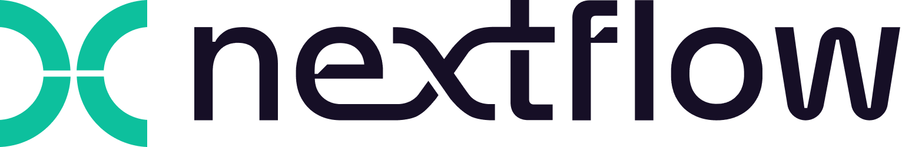

<!-- Add some CSS for horizontal scrolling in samplesheet blocks -->

```{=html}
<style>
  .scrollable-horizontal {
    overflow-x: auto;
    white-space: nowrap;
  }
</style>
```
Sections of the teaching material for this workshop, contains materials which have been adapted or modified from the following sources *(we thank the curators and maintainers of all of these resources for their wonderful contributions, compiling easy to follow training for beginners)*:

-   Beta phase of carpentries material: <https://carpentries-incubator.github.io/workflows-nextflow/>

# Introduction to Workflow Automation

Analyzing data, regardless of the domain, involves executing a sequence of computational steps in order to clean and process the data into a format that's easier to interpret. This sequence of steps is called a **workflow**. Traditionally, steps within a workflow have been chained together using languages like Bash or Perl, however as workflows have grown more complex, the need for more sophisticated features to help manage and execute each step in a workflow has increased.

## Workflow Management Systems

**Workflow Management Systems (WfMS)**, such as Snakemake, Nextflow, and WDL, were developed to help handle the growing complex needs of computational workflows. These systems come with multiple features to simplify execution of a workflow:

-   **Environment Management & Portability**: WfMS possess native support for containerization tools, such as *Singularity* and *Docker*, allowing users to define environments for the entire workflow or for individual tools, helping ensure reproducible results across various compute systems.

-   **Re-entrancy:** WfMS allow users to restart workflows at points other than the first step. This ensures that if the workflow fails, restarting the workflow will begin at the step that failed rather than restarting from the beginning. This is normally internally done by the WfMS by keeping track of what files each step uses as input and which files should be produced as output, and evaluating that against what files have been generated.

-   **Monitoring & Management**: WfMS allow users to monitor workflows as they are processing, providing users information about steps as they execute. Additionally, WfMS typically provide logs of the behavior as the workflow executes, allowing users to review in-depth information from each step of the workflow.

-   **Parellization & Scalability**: WfMS provide ways for steps to be split up so they may run in parallel as well as in sequence, allowing for workflows to run much faster than if each step was run sequentially.

#### Workflows and Reproducibility

As mentioned previously, one of the important benefits of using workflow management systems is reproducibility. By ensuring that analyses are reproducible, you or any other person is able to run a workflow and receive the exact same results. One of the ways that WfMS ensure reproducibility (as well as portability) is via native support for tools that utilize containers, such as Docker or Singularity.

A container is a packaged up snapshot of code (or software) and all of its dependencies. A container allows the application it encapsulates to run on any machine afterwards. Containers help with the automation of installing all the packages and dependencies and minimizes the chance for error and deviation during the installation process.

It is highly recommended that any code or analysis that is meant to be shared should be encapsulated in a container as that will help in increasing the reproducibility of your work.

## Nextflow

<br>

<center>

{width="50%"}

</center>

<br>

While there are many WfMS, the topic of this lesson is **Nextflow**. Nextflow is a workflow management system that is written using the dataflow programming model. Dataflow Programming means that each step in your workflow definition, waits until it receives input from an upstream step, does work, and then sends outputs to a downstream step. Programming in this way helps ensure that Nextflow is able to run steps in parallel and have data at various states in the workflow until it completes.

While this lesson does not cover developing Nextflow workflows, there are some aspects and definitions that are important to know:

-   Nextflow is built on top of a programming language known as Groovy. Groovy is an object-oriented language that runs on the Java Virtual Machine (JVM) and its syntax looks very similar to Java.

-   Nextflow workflows are composed of three main parts:

    1.  **Workflows** is the definition of the series of steps to complete an analysis, containing all the interaction between processes and channels, as well as any additional or custom implementation needed for the analysis.

    2.  **Channels** contain data produced by processes. Channels will asynchronously accumulate output from one process and pass it as input to a downstream process as soon as data completes. Due to the way channels are implemented, this allows for datasets to be in various states of analysis even if they all had the same starting point.

    3.  **Processes** describe the step to be executed, often in script form. Process scripts can be written in any language that can be executed by the Linux platform (Bash, Perl, Python, R, Java, etc.). Processes define the expected inputs and outputs for a step, and spawn a process task for each complete input set. Importantly, each process task is fully independent and isolated, meaning it cannot interact with its sibling tasks.

Importantly, Nextflow is supported across all major platforms, including but not limited to cloud computing (e.g.: AWS) and High Performance Computing (HPC) such as UAB's HPC system (Cheaha).

## nf-core

<br>

<center>

{width="50%"}

</center>

<br>

nf-core is a global community-led effort to curate and develop analytical workflows using Nextflow. All workflows published as part of nf-core are open source and there are a wide range of workflows published currently supporting analyses such as single-cell or ATAC-seq. The community itself is not specifically limited to bioinformatics, but most workflows published so far have all been within this domain. One point to be noted, is that the nf-core team has published standards and tools to create a styling guidelines for nf-core pipelines. However, any Nextflow workflow is able to use these standards and tools even if they do not wish to publish as part of nf-core.

**Available workflows** To view a list of all workflows (released and in development), please visit <https://nf-co.re/workflows>.

### nf-core resources

Beyond being a hub of computational workflow, a critical strength from nf-core lies in its actively engaged community and resources. Instructions on gaining access to the following resources is available at: <https://nf-co.re/join>

-   **Community engagement** nf-core has various avenues of engagement, including but not limited to:
    -   **Slack** this is a vast resource for the community to ask questions or search history for previously discussed topics. Each pipeline has its own channel. In additional there are additional channels for more general questions, along with channel dedicated towards pipeline development needs.
    -   **YouTube** nf-core's channel includes a wide-variety of topics including training materials. Importantly, Nextflow also contains its own YouTube channel which is a great complement to the teaching materials available online.
    -   **Bytesizes talks** linked to the above from the YouTube channel, nf-core runs a series of bytesizes talks, which can be browsed directly from YouTube or from <https://nf-co.re/events/bytesize>
    -   **Training events** be on the look out for training opportunities. nf-core's scheduled can be seen at: <https://nf-co.re/events/training>
    -   **Hackathons** if you would like to get started with pipeline development, or maintance, a great opportunity is the nf-core hosted hackthons: <https://nf-co.re/events/hackathon>
