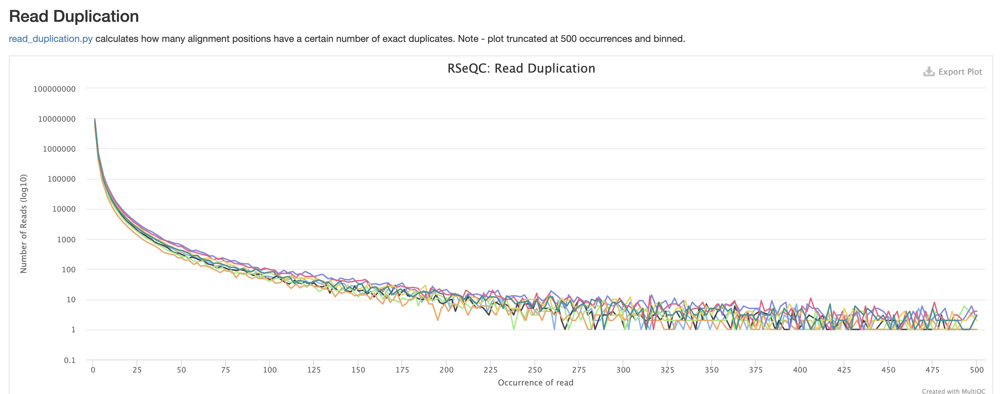
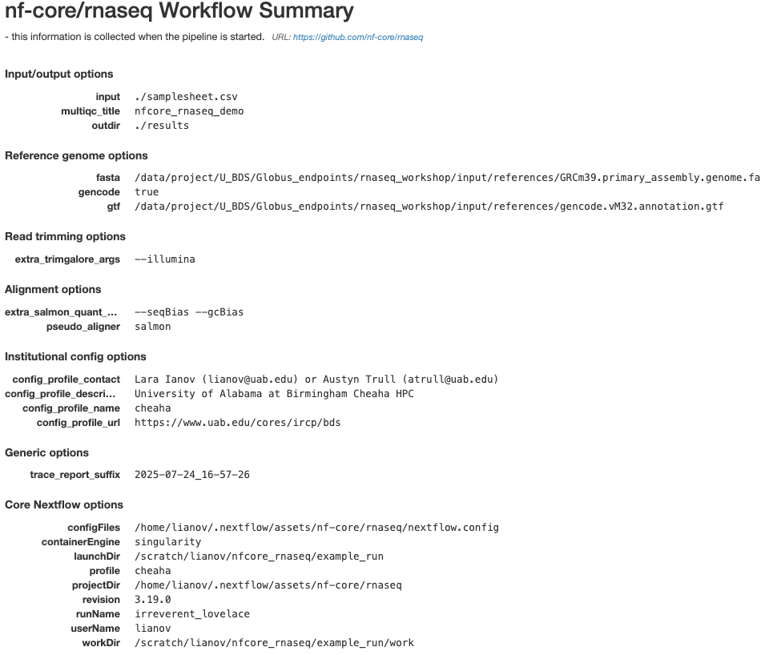

<!-- Add some CSS for horizontal scrolling in samplesheet blocks -->

```{=html}
<style>
  .scrollable-horizontal {
    overflow-x: auto;
    white-space: nowrap;
  }
  
pre {
  background: none !important;
  border: none !important;
  overflow-x: auto;
  padding: 0; /* Let inner code handle padding */
  margin: 1em 0;
}

pre code {
  background: #f8f8f8 !important;
  display: inline-block;
  min-width: 100%;
  white-space: pre;
  padding: 1em;
  border: 1px solid #ddd;   /* border now follows scrollable area */
  border-radius: 6px;
  box-sizing: border-box;
}
</style>
```

# Intro to RNA-Seq

> **Discussion Question**
>
> Has anyone performed any RNA-Seq analysis? What tools have you used?

The FASTQ file on its own doesn’t really tell much information. In order to move forward with the data for our workshop, these raw data will need to be converted into raw expression data.

The rnaseq workflow developed and published by nf-core will be the workflow that this lesson will be uses to demonstrate Nextflow and nf-core: <https://nf-co.re/rnaseq/>

This workflow has a lot of tools that are part of it, and a user may choose to run it in default mode (tools that are executed by default), or configure it to run with more or less tools/steps.


<br>

------------------------------------------------------------------------

**Note:** Importantly, this workflow is designed for short-read sequencing (e.g.: Illumina). Long-read bulk RNA-Seq requires distinct analytical steps which are linked to the nature of long read vs short read sequencing. While bulk long-read sequencing is beyond to scope of this workshop, nf-core has workflows for long-read sequencing (e.g.: for more information see the `nf-core/nanoseq` workflow).

------------------------------------------------------------------------

RNA-Seq workflows follows generally the below pattern:

1.  Quality-control
2.  Read trimming/filtering
3.  Read mapping (alignment, quasi-mapping or pseudo-alignment)
4.  Counting / quantification

The workflow contains several quality control steps in order to assist in the determination of any steps where an error may have happened or to determine viability of the samples as they progress through the workflow.

Additionally the workflow also provides support for experimental specific approaches which we will not cover in today's workshop. This includes as an example: removal of genome contaminants in expected model types (e.g.: mouse PDX / xenograft) and inclusion of Unique Molecular Identifier (UMI) tagging for PCR deduplication (an optional molecular preparation step).

### Trimming and filtering

A common initial step in RNA-Seq workflows is often read trimming and filtering. A common type of trimming is adapter trimming. Adapters are artificial sequences that are attached to the DNA fragments to be sequenced to ensure that the fragment attaches to the sequencing flow cell. Adapters are normally also sequenced with the fragment, meaning some of the reads may have bases that are not biological and can impact the accuracy of mapping and other downstream analyses. In order to alleviate this concern there are dedicated tools published that will remove adapters (also referred to as “adapter trimming”). Some examples of tools that do this are `TrimGalore`, `BBmap`, or `Trimmomatic.`

The `nf-core/rnaseq` workflow additionally supports the removal of contamination with `bbsplit` (e.g.: xenograph experiment, or un-expected genomic contamination), and removal of ribosomal RNA using `SortMeRNA`.

### Alignment

Following trimming is alignment/mapping. With RNA-Seq, there is more than one approach to alignment, the and nf-core/rnaseq workflows supports various methods.

Alignment is the process by which a read is mapped to a reference genome. `STAR` is considered the standard aligner for RNA-Seq. The reason it is used over traditional mappers such as `bwa` is due to `STAR` being a splice aware aligner, where exon-exon junctions are taken into account at the mapping stage. `STAR` alignment outputs (BAM files) can be critical for use-cases where genome alignment is required such as gene fusion identification, or variant-calling/genome-wide/exome data integration.

The second type of alignment/mapping supported is "quasi-mapping"/"pseudo-alignment".

`Salmon` is a quasi-mapper which implements k-mer based indexing of the transcriptome (as opposed to the genome) to perform lightweight mapping to the reference. Similarly, `kallisto` also implements k-mer indexing of the transcriptome, but it processes the reads without mapping, and instead identifies k-mers within the reads which are compatible and shared to the index. Thus, a key difference between the tools is that pseudo-alignment relies on shared k-mers between the reference and the reads, while quasi-mapping implements efficient lightweight mapping using the k-mer indexed reference.

Lastly, `Salmon` and `kallisto` are computationally efficient, leading to rapid mapping with low memory use.

### Counting

Feature (gene or transcript) quantification is typically the last analytical step of an RNA-Seq workflow. Importantly, the outputs of `Salmon` and `kallisto` are quantified counts, as opposed to `STAR` which are mapped data (BAM files), where an additional quantification tools is required. In the nf-core/rnaseq workflow `Salmon` is implemented as the read quantifier from a `STAR` alignment.

The count outputs format typically contains a list of features (genes names or IDs) as rows and their relative abundance as columns for each sample:

<div style="width:40%; margin:auto; text-align:center;">

|feature (e.g: genes)|quantified counts per sample*|
|:----:|:----:|
|feature1|102|
|feature2|10|
|feature3|502|
|feature4|53|
|feature5|300|

</div>

**Note***: the exact column names from a quantified matrix will be dependent on the quantifier - but the overall structure above (features by counts) is expected.

------------------------------------------------------------------------

As discussed earlier, the workflow we will cover also contains several additional steps for QC and optional steps dependent on design or analytical needs. The primary steps covered in the sections above are the required analytical steps across all bulk RNA-Seq analysis.

------------------------------------------------------------------------

# Executing nf-core/rnaseq

## Compute resources

nf-core pipelines are designed to run seamlessly across a wide range of computing environments — from local computers to HPC systems and cloud platforms. At UAB, researchers and trainees have access to Cheaha, our dedicated HPC cluster, which offers significantly greater computational power than a typical local computer In this workshop, we will demonstrate how to execute an nf-core pipeline within the Cheaha environment, showcasing the benefits of leveraging HPC resources for large-scale bioinformatics analyses.

### Institutional profiles

Institutional profiles are standardized Nextflow configuration files designed to support community members across various institutions. The use of an institutional profile is enabled via the `-profile` parameter, and it is maintained within the nf-core "configs" GitHub repository: <https://github.com/nf-core/configs>

<br>
<center>
{width="60%"}
</center>
<br>

The Cheaha UAB institutional profile was created by U-BDS, with detailed documentation at: <https://nf-co.re/configs/cheaha/>. In the demonstration section of this workshop, participants will see that this profile is enabled via the flag: `-profile cheaha`. Enabling this profile, allows users to leverage the full scope of an HPC system and its schedule. The profile automatically defines the executor (Slurm), enables Singularity, auto mounts specific directories in our HPC cluster, and defines partitions based on job resources.

#### Changes to the Cheaha profile

If you would like to see the Cheaha profile expanded beyond what is currently available, please contact the profile maintainers: Austyn Trull and Lara Ianov (yes, your workshop instructors!)

Alternatively, if you have a specific use case which warrants a change which may not be suitable for a global wide change, you may adopt the profile into a Nextflow custom file. While this topic goes beyond the scope of this workshop, U-BDS is happy to address this request during weekly office hours.

### Using Cheaha

Research Computing (RC) offers detailed documentation at <https://docs.rc.uab.edu/> on tutorials for getting started with Cheaha. Overall, while there is more than one way of accessing the cluster, we will run our demonstration with the resources available through the OnDemand platform since this is a user-friendly interface across varying computational environments.

OnDemand is available at: <https://rc.uab.edu/pun/sys/dashboard/>

OnDemand provides an interactive file system that can be accessed by clicking on `Files` in the upper left of the OnDemand homepage, and then clicking `/scratch/<blazer_id>` in the dropdown (NOTE: The `<blazer_id>` in the path should be replaced with your blazer id).

We'll navigate to the directory where we have moved the input files which will be used for the nf-core/rnaseq demo:

```         
/scratch/<blazer_id>/nfcore_workshop
```

> **NOTE**
>
> For this lesson, we'll be using the onDemand Editor provided by UAB Research Computing in order to edit and create files. However, if you are more comfortable using a software editor such as `vim`, `nano` , or `Visual Studio Code`, that is also acceptable.


## Testing the workflow

Every nf-core pipeline is released with a downsampled test profile that allows users to quickly verify the pipeline and its configuration on their system. We strongly encourage users to take advantage of this profile to rule out any technical issues or configuration errors before running full-scale analyses.

Below is a script which contains the test profile run for the nf-core/rnaseq data. This script has been named `run_test_rnaseq.sh` in the GitHub repository of this lesson. Each section of the script is subsequently explained:

> **NOTE**
>
> It is considered bad practice to execute any script or command that requires large amounts of resources on the login node of a supercomputer. Not only does it take resources from other users on the login node, but it can cause errors and system failures for the super computer itself, therefore **ALWAYS** ensure you either submit code to the computer OR execute code in an interactive session.

```bash
#!/usr/bin/env bash

#SBATCH --job-name=rnaseq_test
#SBATCH --output=rnaseq_test.out
#SBATCH --error=rnaseq_test.err
#SBATCH --time=2:00:00
#SBATCH --partition=express
#SBATCH --mem-per-cpu=5000
#SBATCH --cpus-per-task=1

# prep your environment
# note that conda environment creation is listed in install instructions
module load Anaconda3
conda activate $USER_SCRATCH/conda_envs/nfcore_workshop

# run test profile
nextflow run nf-core/rnaseq -profile test,cheaha -r 3.19.0 --outdir results_test
```

The script above can be submitted with the following command via the commandline available from OnDemand (or alternatively, via a terminal from your computer if you `ssh` to the cluster):

```bash
sbatch run_test_rnaseq.sh
```

To break down each line:

**All `#SBATCH` lines are Slurm directives for our test job:**

-   `#!/usr/bin/env bash`: This is known as a `shebang`. It is standard practice to put this line at the top of any script you make, as it is used by the computer to assist in determing which language the script will be using. In this case we are letting the computer know that this is `bash` script. 
-   `--job-name` : Submitting code on the cluster is called a job. The `job-name` flag assigns a user-generated name to the job to allow for easier tracking. Job names should be short and descriptive in order to assist in determining a job. In this case we will be naming out job `rnaseq_test`.
-   `--output` and `--error` : These are for defining files to place the `stdout` and `stderr` output of the command being submitted. Because these jobs are not interactive, if these flags are not defined, the output will be lost. Instead of providing the direct name to these directives, Slurm provides file name patterns which can be used. For instance, adding `%j_%x.out` and `%j_%x.err` will generate outputs with the following file name pattern: job id and job name.
-   `--time` : This defines the amount of time you expect a command to run. If a job runs longer than this command, it will be killed by Cheaha.
-   `--partition` : There are a number of partitions available on Cheaha. The `express` partition is for jobs you expect to run in less than 2 hours. There are also `short`, `medium`, and `long` queues, which have their own maximum run time that can be found in the Cheaha documentation. It is recommended to choose the partition that best fits the needs of your workflow, as choosing the wrong one can result in your scripts being killed too soon or causing very long pending times.
-   `--mem-per-cpu` : This defines how much memory a job will take multiplied by the number of cpus requested. There is not good way to determine the memory a job will take ahead of time, so it is very common for this to take some iteration as the script will be killed if it goes over the memory limit specified in this file.
-   `--cpus-per-task` : This defines how many CPUs you expect a job to take.

We are specifying pretty low memory and time requirements for this job since test profiles are made of down-sampled / small data sets. Further, it's also important to note that submitting a job like this will always require low memory since we are submitting what is known as the **Nextflow runner job**. The Nextflow runner's job is to just to submit the steps in the workflow that do the actual work for the workflow.

**Environment**

Loading `Anaconda3` and activating our conda environment are necessary steps prior to the workflow start. This tells the script to initiate the dependencies needed to execute the pipeline.

**Execute the test profile along with the Cheaha profile**

The `nextflow` line contains are the needed parameters to test the installation of our workflow. Specifically:

-   `nextflow run` initiates a nextflow workflow. `nf-core/rnaseq` tells which nf-core workflow to run. This can be changed to any other nf-core pipeline available.

-   `-profile test,cheaha` : this tells nextflow which presets to use for the workflow. In this case, we enable both the `test` profile and the `cheaha` profile to execute the test run while also implementing the cheaha configuration file. One point to note is that if you pass in multiple profiles corresponding to the same workflow parameters, the last one takes precedence.

-   The `-r` specifies a version of the workflow to use. This is an important parameter for reproducibility as we can force rnaseq to run at a specific version. If you do not use this parameter, the workflow will default to the latest version. We always recommend to specify a version, even when using the latest version.

-   `--outdir results_test` With this flag we are noting where the workflow needs to place all the output files, in this case it will be a directory called `results_test`.

## Understanding the dataset

Let's start moving to actual data. In order to run the data, it's important to understand the data a little more before proceeding.

The data comes from the following paper: <https://www.ncbi.nlm.nih.gov/pmc/articles/PMC6096346/>

The data that we will be analyzing is mouse transplant data. The original paper contains 12 samples in total - 4 naive controls, 4 from 2 hours past transplant, and 4 from 24 hours past transplant. For this workshop, we will only be concerned with the controls and the 24 hour samples (however, note that all 12 samples are provided in the Globus endpoint).

Another point to note is that the paper we are obtaining the data from is a beginner’s guide for RNA-Seq published about 7-8 years ago. Given the timeline, you will note that are some differences from the analysis that was done for the paper versus the analysis done today. The reason is a lot of the tools used by the paper are considered outdated or have been phased out of the field. Bioinformatics and computational biology are fast-paced domains. Thus, it is important to ensure that all analyses are using correct and modern approaches. In summary, always ensure that the tools and workflows you apply to your analysis are up to date to what is considered best practice in the RNA-Seq domain.

## Creating the samplesheet

So lets work on running the workflow on actual data. The RNAseq workflow (like most nf-core workflows) receives input via a samplesheet. The format of which can be seen here:

<https://nf-co.re/rnaseq/3.19.0/docs/usage>

Thus, a completed samplesheet (named `samplesheet.csv` in our workshop materials) with 8 samples from the available 12 from this dataset, looks like the following:

::: scrollable-horizontal
```{=html}
<pre>
sample,fastq_1,fastq_2,strandedness
N02_AM_Naive,/data/project/U_BDS/Globus_endpoints/rnaseq_workshop/input/fastqs/SRX4328049_SRR7457560.fastq.gz,,auto
N01_AM_Naive,/data/project/U_BDS/Globus_endpoints/rnaseq_workshop/input/fastqs/SRX4328050_SRR7457559.fastq.gz,,auto
N04_AM_Naive,/data/project/U_BDS/Globus_endpoints/rnaseq_workshop/input/fastqs/SRX4328051_SRR7457558.fastq.gz,,auto
N03_AM_Naive,/data/project/U_BDS/Globus_endpoints/rnaseq_workshop/input/fastqs/SRX4328052_SRR7457557.fastq.gz,,auto
R08_AM_Allo24h,/data/project/U_BDS/Globus_endpoints/rnaseq_workshop/input/fastqs/SRX4328047_SRR7457562.fastq.gz,,auto
R07_AM_Allo24h,/data/project/U_BDS/Globus_endpoints/rnaseq_workshop/input/fastqs/SRX4328048_SRR7457561.fastq.gz,,auto
R06_AM_Allo24h,/data/project/U_BDS/Globus_endpoints/rnaseq_workshop/input/fastqs/SRX4328057_SRR7457552.fastq.gz,,auto
R05_AM_Allo24h,/data/project/U_BDS/Globus_endpoints/rnaseq_workshop/input/fastqs/SRX4328058_SRR7457551.fastq.gz,,auto

</pre>
```
:::

Please note that the path above is relative to the U-BDS Globus endpoint which hosts this data. You will need to update the path to the directory contianing the copy of this data (e.g.: your `USER_SCRATCH`)

Note that the first row should contain the expected column names: `sample,fastq_1,fastq_2,strandedness`

To break down each column:

-   `sample` : Sample identifier for the FASTQ file. If you have technical replicates of the same biological samples, rows with the same sample identifier will be automatically concatenated in the pipeline.
-   `fastq_1`: Path to the R1 read of the FASTQ file or the single-ended read. Please note that the path above is relative to the U-BDS Globus endpoint which hosts this data. You will need to update the path to the directory contianing the copy of this data (e.g.: your `USER_SCRATCH`)
-   `fastq_2`: Path to the R2 read of the FASTQ file. For single-ended data, leave this column blank.
-   `strandedness`: Library strandness. This is linked to the library preparation method implemented. If unknown, indicate `auto` - for auto-detection within the pipeline.


> **Discussion Question**
>
> You'll note that we have two commas next to each other in the samplesheet, which means we have left a column empty. The data for this workshop is single-ended, meaning that there is just a single FASTQ for us to analyze per sample. It's also common for data to be paired-ended, which for us would result in a pair of FASTQs for each sample, known as an read 1 and read 2.
>
> Can anyone tell me what we would change with this samplesheet if the data was paired-end instead of single-end?
>
> <details>
>
> <summary>**Click here for solution**</summary>
>
> We would need to fill in the column that is left blank with the path of the R2 reads. The samplesheet headers help guide us in what information needs to be placed in each column. In this case, `fastq_1` would correspond to the read 1 fastq and `fastq_2` would correspond to the read 2 fastq.
>
> </details>

## Adding workflow parameters

One point of customization is the workflow parameters. The amount of configurability the parameters provide is very dependent on the workflow and the workflow authors, so we won’t be able to customize every aspect of the workflow, but parameters are often based on common requests by users of the workflow.

The parameter options for an nf-core can be found on the workflow website, for rnaseq v 3.19.0, it's available here: <https://nf-co.re/rnaseq/3.19.0/parameters>

While there are a lot of options, it's very rare that you will need all of these as the workflow authors have set sensible parameters. But these range from everything - from required inputs to which steps to run in the workflow. It is **heavily encouraged** to read through this when doing your own analysis to evaluate if there are any flags that may apply, as well as to note the default flag values as these can have notable impact on analyses.

Parameters are able to be passed as flags to the command line or via a yaml file. For the workshop, we will use the yaml option in order to keep the workflow execution command more straight-forward.

For the workshop demonstration, the parameters in our `params.yml` file are:

```yaml        
# names/email
# email: "" # disabled for our demo run
multiqc_title: "nfcore_rnaseq_demo"

# input samplesheet
input: "./samplesheet.csv"

# Genome references
fasta: "/data/project/U_BDS/Globus_endpoints/rnaseq_workshop/input/references/GRCm39.primary_assembly.genome.fa"
gtf: "/data/project/U_BDS/Globus_endpoints/rnaseq_workshop/input/references/gencode.vM32.annotation.gtf"
gencode: true

# Read Trimming Options
trimmer: "trimgalore"
extra_trimgalore_args: "--illumina"

# Alignment Options
aligner: "star_salmon"
pseudo_aligner: "salmon"
extra_salmon_quant_args: "--seqBias --gcBias"

# Quality Control
deseq2_vst: true
```

-   `email` : an optional parameter that we have disabled, but recommended if you would like email notifications.
-   `multiqc_title` : title to the MultiQC report.
-   `input` : path to the `samplesheet.csv`.
-   `fasta` : path to the genome FASTA reference file.
-   `gtf` : path to the GTF reference file.
-   `gencode` : boolean (`true` or `false`) indicating if the GTF is in GENCODE database format (<https://www.gencodegenes.org/>). The reference provided by this workshop is derived from GENCODE.
-   `trimmer` : indicate tool to be used for trimming. `trimgalore` is the default - we specify for demonstration purposes.
-   `extra_trimgalore_args` : arguments within `trimgalore` which can be specified. As an example `--illumina` is `trimgalore` parameter.
-   `aligner` : Aligner of choice. `star_salmon` indicates the nf-core/rnaseq will execute `STAR` for the alignment, followed by `salmon` for quantification
-   `pseudo_aligner` : Pseudo-aligner/quasi-mapping of choice. `salmon` indicates that the data will be quasi-mapped and quantified by Salmon.
-   `extra_salmon_quant_args` : arguments within `salmon` which can be specified here.  As an example `--seqBias --gcBias` are `salmon` parameter which we commonly use.
-   `deseq2_vst` : boolean for the implementation of DESeq2's vst transformation over rlog.


## Submitting the workflow

With all configuration related files created, we can now submit the workflow with the `run_rnaseq.sh` script below:

```bash    
#!/usr/bin/env bash

#SBATCH --job-name=nfcore_rnaseq
#SBATCH --output=nfcore_rnaseq.out
#SBATCH --error=nfcore_rnaseq.err
#SBATCH --time=12:00:00
#SBATCH --partition=short
#SBATCH --mem-per-cpu=5000
#SBATCH --cpus-per-task=1

# load environment
module load Anaconda3
conda activate $USER_SCRATCH/conda_envs/nfcore_workshop

# run workflow
nextflow run nf-core/rnaseq \
    --outdir ./results \
    -profile cheaha \
    -r 3.19.0 \
    -params-file ./params.yml
```

The script above can be sumited with `sbatch run_rnaseq.sh`

Note that the script above, is similar to how we executed the `test` profile. The changes are highlighted below:

-   `#SBATCH` resources : since this run is expected to take longer than the `test` profile, we have increased the time limit and selected a more suitable partition to allow the Nextflow runner to stay active the entire duration of the run. When running a pipeline on a new dataset, the required runtime for the runner may not be immediately apparent. In such cases, some trial and error is often necessary to determine the optimal time allocation and partition for efficient execution.
-   `-profile` : the selected profile is now only the `cheaha` profile.
-   `-params-file` : the path to the yaml file containing our pipeline parameters.

### Inspecting a running job

There are various ways which you can check your running jobs. Here are a few methods that we can check a running job:

1. You can check the standard output and error files (`.out` and `.err`) for logs. They are expected to be updated as the run goes, and if an error occurs, these can be good starting point for troubleshooting.
2. Regardless of the standard output/error files, Nextflow will always generate a log file named `.nextflow.log` in the current working directory. Note the `.` in front of the file name - thus this is a hidden file that can only be listed from `ls` with the flag `a` (e.g.: `ls -la`).
3. You may also check the running status of the Nextflow runner's jobs (and the jobs it submits) with the following command: `squeue -u $USER`. This command will list all running jobs, including the Nextflow runner job along with all jobs submitted to the cluster (since we are using the `cheaha` profile).
4. Slurm job IDs - they can be useful to fetch specific job information. One common command is `seff <job_id>`. The `seff` output provides an overview of the job state and how many resources it used. Another alternative, which can provides a lot more detail is `sacct -j <job_id>`, nothing that `sacct` has wide range of information that can be outputted via the flag `--format`, e.g.: `sacct -j <job_id> --format=JobID,Start,End,Elapsed,NCPUS,NodeList,NTask,Timelimit,ReqMem`. The options to `--format` can be viewed [here](https://slurm.schedmd.com/sacct.html#OPT_helpformat).

------------------------------------------------------------------------

# Anatomy of a Nextflow run

## Workflow metrics

Inside the `results` directory, there is a `workflow_info` directory that contains the metrics and statistics for the jobs the workflow submitted to the cluster. We are going to review the report and timeline files.


The report file provides details on the resource and timings for each process that was executed as part of the workflow. This is useful in helping to narrow down jobs with high memory usage for optimization purposes.


The timeline file provides a detailed timeline noting when each process was executed. This is especially useful in being able to estimate how long a workflow may take and to identify long running tools.

## Workflow outputs

The rnaseq workflow produces a lot of output files. Many of them are for qc and general review of the workflow user. Due to the amount of files, we will only go over some of the more commonly used files in this workshop, but note that this workflow (along with other nf-core workflows) have dedicated documentation for noting the various output files. For nf-core/rnaseq, the description of all the output files can be found [here](https://nf-co.re/rnaseq/3.19.0/docs/output).

### MultiQC report

The first point of review for the workflow is the multiqc report. MultiQC is a very useful tool that aggregates a number of different tools into a single report, providing a quick way of reviewing the quality of the data to determine if there are any potential concerns.

The first table in the multiqc report is the "General Statistics Table". This provides a high level overview of various metrics, from read counts in the BAM to read counts in the FASTQ. It's a lot of metrics, but this is useful in the accessing if a large amount of data filtration occur. This is also a good place to check if the samples have sufficient sequencing depth. Standard mRNA-Sequencing typically requires an average of \~25M reads. This requirement increases for whole-transcriptome (where other RNA species are also quantified). For more reading abour sequencing depth consideration, please visit [this Illumina resource](https://knowledge.illumina.com/library-preparation/rna-library-prep/library-preparation-rna-library-prep-reference_material-list/000001243).


RNASeq does the very initial stages of tertiary analysis. It is definitely recommended to do these on your own rather than rely on the results from rnaseq as these are very generic. These results help indicate if there are any outliers within your dataset or if there are potential sample swaps that may be a concern as we expect samples that are similar to each other to indicate that.


The next three qc reports are very useful for rnaseq. We expect these reads to be from exonic, protein coding regions. These QC's act as good sanity checks that our data matches our assumptions.


`RSeQC` is tool with a lot of quality-control for RNA-Seq data. In addition to the above, it also lets us check for duplication levels. The image below is indicative of a good 'normal' plot for this metric.



There are a couple variations of BAM metrics. `SAMtools` is a common tool with a number of subtools that provide useful metrics for your BAM. The key points to look for are mapping rates, unique mappings, (and properly paired in the case of paired FASTQs) as those are expected to be high regardless of dataset, though the degree varies based on species.


The mappings per chromosome can vary, but in general the smaller the chromosome the less mappings will occur, so this graph is pretty normal.


In the case of experiments involving multiple sexes of organisms, the XY count chart can be very useful for ensuring no sample swap has occurred.


In addition to `SAMtools`, `STAR` provides its own versions. We again are looking for high unique mappings. Multi mapped regions are okay though, we just need to make sure they are not the overwhelming majority.


`FastQC` is a very common tool used for providing metrics for FASTQ files. There is also a `FastQC` report that gets generated, but its on a per-sample basis and as a result does not aggreate the results like in MultiQC.

We also note that the `FastQC` plot below also qc duplicate rates from the raw data. Bear in mind unless the RNA-Seq library preparation protocol implements UMI-tagging, duplicates cannot be removed from RNA-Seq data (as it is not possible to differentiate technical/artifact duplicates from biological duplicates derived from the high abundance of RNA molecules / expression).


For short read data, we expect the mean quality score to remain well in the green section. But it's important to note that there are quality drops at the start and end of the read and this is a result of the technology, and that any low quality reads (based on trimming parameters) are removing at the trimming step.


The Per Base Sequence Content is very useful for determing if there is any potential issue with the FASTQ. You'll again notice there are issues at the start and end of the reads and its universal across samples. Clicking each row provides a better view of which base is the strongest. This is again pretty expected for reasons mentioned earlier, but always worth investigating.


This is pretty typical GC Content, anything wrong with this could indicate species contamination.


Per Base N Content indicates how many 'N's' were detected in the dataset. N's mean the base was unable to be determined, and high levels could indicate a potentially significant sequencer error.


We expect a level of adapters in our data, however note that this is pre trimmed figure, and that they are removed at the trimming step.


Finally there are the workflow data. Just below the citations, are the tool versions. This is useful for manuscript writing, and for reporting tool-specific versions (along with the rnaseq workflow version). It is also critical to cite the workflow, the nf-core community and the tools' developers at the writing stage (many of these tools have published papers available for citation).

All nf-core workflows contain a `CITATION.md` document listing all tools and proper citation. The `README.md` file contains the method to cite the workflow.


The workflow summary indicates what parameters and options were used during the analysis.



### Workflow Intermediary Files

The Nextflow `work` directory contains all the files generated by the workflow. Nextflow hashes all of its processes for both memory and to assist with caching, however it makes it much harder for us to locate information for the individual processes.

Along with the process outputs, the `work` directory typically contains:

-   `.command.begin`: This file contains commands that need pre-execution setup steps. This file is always generated, even if there are no pre-execution setup steps.
-   `.command.run`: This file is a wrapper script by Nextflow used to launch `.command.sh` and capture environment information
-   `.command.sh`: This file contains the script executed by the Nextflow process.
-   `.command.log`: This file captures stdout and stderr for a process
-   `.command.out`: This file captures the stdout for a process.
-   `.command.err`: This file captures the stderr for a process.
-   `.command.trace`: This file captures environment and resource usage information for a process.
-   `.exitcode`: This file contains the exit code for the process.
-   Input files: These are files or symlinks defined as inputs to the process.
-   Output files: These are files generated by the process as defined by the process.

Key results from the `work` directory are copied over to the `outdir` - deleting the work directory may be desired to avoid duplication of files, and minimize storage footprint since it also contains all intermediate files. **However** deleting this directory also removes the log files (the .command.* files) and prevents you from resuming a pipeline execution (with `-resume`). If you do not need to resume a pipeline run, and would like to remove large files from the work directory while keeping the logs, you may clean this directory with the command `nextflow clean -k -f` (before doing so we recommend performing a dry-run prior to this with `nextflow clean -k -n`).
