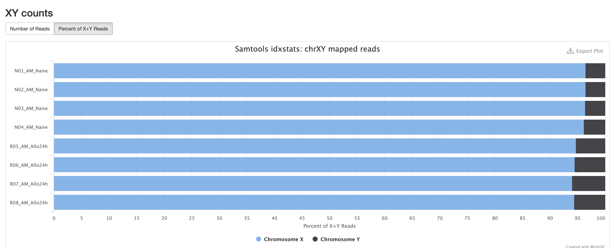

<!-- Add some CSS for horizontal scrolling in samplesheet blocks -->

```{=html}
<style>
  .scrollable-horizontal {
    overflow-x: auto;
    white-space: nowrap;
  }
</style>
```

# Intro to RNA-Seq

> **Discussion Question**
>
> Has anyone performed any RNA-Seq analysis? What tools have you used?

The FASTQ file on its own doesn’t really tell much information. In order to move forward with our project, these raw base calls need to be converted into raw expression data.


<br>

The rnaseq workflow developed and published by nf-core will be the workflow that this lesson will be uses to demonstrate Nextflow and nf-core.

This rnaseq workflow has a lot of tools that are part of it, and a user may choose to run it in default mode (tools that are executed by default), or configure it to run with more or less tools/steps.

------------------------------------------------------------------------

**Note:** Importantly, this workflow is designed for short-read sequencing (e.g.: Illumina). Long-read bulk RNA-Seq requires distinct analytical steps which are linked to the nature of long read vs short read sequencing. While bulk long-read sequencing is beyond to scope of this workshop, nf-core has workflows for long-read sequencing (e.g.: for more information see the `nf-core/nanoseq` workflow).

------------------------------------------------------------------------

RNA-Seq workflows follows generally the below pattern:

1.  Quality-control
2.  Read trimming/filtering
3.  Read mapping (alignment, quasi-mapping or pseudo-alignment)
4.  Counting / quantification

The workflow contains several quality control steps in order to assist in the determination of any steps where an error may have happened or to determine viability of the samples as they progress through the workflow.

Additionally the workflow also provides support for experimental specific approaches which we will not cover in today's workshop. This includes as an example: removal of genome contaminants in expected model types (e.g.: mouse PDX / xenograft) and inclusion of Unique Molecular Identifier (UMI) tagging for PCR deduplication (an optional molecular preparation step).

### Trimming and Filtering

A common initial step in RNA-Seq workflows is often read trimming and filtering. A common type of trimming is adapter trimming. Adapters are artificial sequences that are attached to the DNA fragments to be sequenced to ensure that the fragment attaches to the sequencing flow cell. Adapters are normally also sequenced with the fragment, meaning some of the reads may have bases that are not biological and can impact the accuracy of mapping and other downstream analyses. In order to alleviate this concern there are dedicated tools published that will remove adapters (also referred to as “adapter trimming”). Some examples of tools that do this are `TrimGalore`, `BBmap`, or `Trimmomatic.`

The `nf-core/rnaseq` workflow additionally supports the removal of contamination with `bbsplit` (e.g.: xenograph experiment, or un-expected genomic contamination), and removal of ribosomal rna using `SortMeRNA`.

### Alignment

Following trimming is alignment/mapping. With RNA-Seq, there is more than one approach to alignment, the and nf-core/rnaseq workflows supports various methods.

Alignment is the process by which a read is mapped to a reference genome. `STAR` is considered the standard aligner for RNA-Seq. The reason it is used over traditional mappers such as `bwa` is due to `STAR` being a splice aware aligner, where exon-exon junctions are taken into account at the mapping stage. `STAR` alignment outputs (BAM files) can be critical for use-cases where genome alignment is required such as gene fusion identification, or variant-calling/genome-wide/exome data integration.

The second type of alignment/mapping supported is "quasi-mapping"/"pseudo-alignment".

`Salmon` is a quasi-mapper which implements k-mer based indexing of the transcriptome (as opposed to the genome) to perform lightweight mapping to the reference. Similarly, `kallisto` also implements k-mer indexing of the transcriptome, but it processes the reads without mapping, and instead identifies k-mers within the reads which are compatible and shared to the index. Thus, a key difference between the tools is that pseudo-alignment relies on shared k-mers between the reference and the reads, while quasi-mapping implements efficient lightweight mapping using the k-mer indexed reference.

Lastly, `Salmon` and `kallisto` are computationally efficient, leading to rapid mapping with low memory use.

### Counting

Feature (gene or transcript) quantification is typically the last analytical step of an RNA-Seq workflow. Importantly, the outputs of `Salmon` and `kallisto` are quantified counts, as opposed to `STAR` which are mapped data (BAM files), where an additional quantification tools is required. In the nf-core/rnaseq workflow `Salmon` is implemented as the read quantifier from a `STAR` alignment.

The count outputs format typically contains a list of features (genes names or IDs) as rows and their relative abundance as columns for each sample.

------------------------------------------------------------------------

As discussed earlier, the workflow we will cover also contains several additional steps for QC and optional steps dependent on design or analytical needs. The primary steps covered in the sections above are the required analytical steps across all bulk RNA-Seq analysis.

------------------------------------------------------------------------

# Executing the nf-core/rnaseq workflow

## Testing the workflow

Importantly, when implementing a novel workflow or tool, it is critical to always test the workflow to ensure that it is installed and working properly. nf-core requires all workflows to have downsampled test data to be able to run a test profile.

We will be using UAB's supercomputer (called `Cheaha`) to run the nf-core/rnaseq workflow, since most common use-cases require resources that are not be readily available in local computers. More specifically, we'll be using the OnDemand application provided by UAB's Research Computing team, which provides an online interface to interact with Cheaha. Thus as a first step, we will need to navigate to the OnDemand website and login using your UAB login. The link can be found below:

`https://rc.uab.edu/pun/sys/dashboard/`

OnDemand provides an interactive file system that can be accessed by clicking on `Files` in the upper left of the OnDemand homepage, and then clicking `/scratch/<blazer_id>` in the dropdown (NOTE: The `<blazer_id>` in the path should be replaced with your blazer id).

We'll navigate to the directory where we have moved the files downloaded from Globus, which can be done by double clicking on directories. Following the install instructions will have placed the files in the directory below (NOTE: The `<blazer_id>` in the path should be replaced with your blazer id):

```         
/scratch/<blazer_id>/rnaseq_workshop
```

> **NOTE**
>
> For this lesson, we'll be using the onDemand Editor provided by UAB Research Computing in order to edit and create files. However, if you are more comfortable using a software editor such as `vim`, `nano` , or `Visual Studio Code`, that is also acceptable.

In order to run the workflow with test data, we’ll want to create a script to submit and run the Nextflow command, thus we will start by creating a file called `run_test_rnaseq.sh`. In order to create a file, click the `New File` button in the upper right of interactive file system, and in the dialog box type `run_test_rnaseq.sh`.

> **NOTE**
>
> It is considered bad practice to execute any script or command that requires large amounts of resources on the login node of a supercomputer. Not only does it take resources from other users on the login node, but it can cause errors and system failures for the super computer itself, therefore **ALWAYS** ensure you either submit code to the computer OR execute code in an interactive session.

Once the file is created, make sure it is highlighted in the file system window and click the `Edit` button located in the upper left of the screen, below the file path. In the new window, we'll start by entering the below text:

```         
#!/usr/bin/env bash
```

This is known as a `shebang`. It is standard practice to put this line at the top of any script you make, as it is used by the computer to assist in determing which language the script will be using. In this case we are letting the computer know that this is `bash` script. Because this script needs to be submitted to Cheaha, it is especially important to place this line in the file. When the job is dispatched to a its own machine, the machine will not know how to execute the script and error immediately.

The next lines we will add are known as slurm directives. Slurm directives are used to define how much resources are needed to execute the job, and define where to place stdout and stderr outputs from the command.

```         
#SBATCH --job-name=rnaseq_test
#SBATCH --output=rnaseq_test.out
#SBATCH --error=rnaseq_test.err
#SBATCH --time=2:00:00
#SBATCH --partition=express
#SBATCH --mem-per-cpu=5000
#SBATCH --cpus-per-task=1
```

To break down each line:

-   `--job-name` : Submitting code on the cluster is called a job. The `job-name` flag assigns a user-generated name to the job to allow for easier tracking. Job names should be short and descriptive in order to assist in determining a job. In this case we will be naming out job `rnaseq_test`
-   `--output` and `--error` : These are for defining files to place the `stdout` and `stderr` output of the command being submitted. Because these jobs are not interactive, if these flags are not defined, the output will be lost. Instead of providing the direct name to these directives, slurm provides file name patterns which can be used. For instance, adding `%j_%x.out` and `%j_%x.err` will generate outputs with the following file name pattern: job id and job name
-   `--time` : This defines the amount of time you expect a command to run. If a job runs longer than this command, it will be killed by Cheaha.
-   `--partition` : There are a number of partitions available on Cheaha. The `express` partition is for jobs you expect to run in less than 2 hours. There are also `short`, `medium`, and `long` queues, which have their own maximum run time that can be found in the Cheaha documentation. It is recommended to choose the partition that best fits the needs of your workflow, as choosing the wrong one can result in your scripts being killed too soon or causing very long pending times.
-   `--mem-per-cpu` : This defines how much memory a job will take multiplied by the number of cpus requested. There is not good way to determine the memory a job will take ahead of time, so it is very common for this to take some iteration as the script will be killed if it goes over the memory limit specified in this file.
-   `--cpus-per-task` : This defines how many CPUs you expect a job to take.

We are specifying pretty low memory and time requirements for this job as because this is downsampled data, it should run very quickly and require very little resources. Its also important to note that submitting a job like this will always require low memory since we are submitting what is known as the Nextflow runner job. The Nextflow runner's job is to just to submit the steps in the workflow that do the actual work for the workflow.

Next, we need to load our conda environment created from our installation instructions to ensure that the required software are active. This can be done with the following:

```         
module load Anaconda3
conda activate $USER_SCRATCH/conda_envs/rnaseq_workshop
```

With all that completed, we can now place the Nextflow command in the file:

```         
nextflow run nf-core/rnaseq -profile test,cheaha -r 3.19.0 --outdir output
```

Breaking the Nextflow command down:

-   `nextflow run` is how to run any nextflow workflow. nf-core/rnaseq tells which nf-core workflow to run, if we were running a single-cell workflow, we’d use nf-core/scrnaseq.

-   `-profile test, cheaha` : Profiles can be thought of as presets for a workflow. The workflow comes with a lot of defaults, but the profiles provide additional defaults for the workflow. The `test` profile tells the workflow that we are going to use the test data for the workflow. The `cheaha` profile is what is called an institutional profile, and the one for use at UAB is `cheaha`. But there are also other institutions and you are able to create your own if one doesn’t already exist. One point to note is that if you pass in multiple profiles corresponding to the same workflow parameters, the last one takes precedence.

-   The `-r` specifies a version of the workflow to use. This is an important parameter for reproducibility as we can force rnaseq to run at a specific version. If you do not use this parameter, the workflow will default to the latest version.

-   `--outdir output` With this flag we are noting where the workflow needs to place all the output files, in this case it will be a directory called `output`.

In order to save the file, we click the `Save` button located in the upper right of the editor window.

The final step is we need to submit our script to cheaha so it can be executed. The way we will accomplish that is via the commandline available from OnDemand. To access the commandline, click the `Open in Terminal` button located in the upper right of the interactive file system.

We'll need to start by navigating to our `rnaseq_workshop` directory (NOTE: The `<blazer_id>` in the path should be replaced with your blazer id):

```         
# Note: /scratch/<blazer_id>/ can be replaced by $USER_SCRATCH variable
cd /scratch/<blazer_id>/rnaseq_workshop
```

In order to submit the command we need to run the below command:

```         
sbatch run_test_rnaseq.sh
```

Once the command is run, you will see output similar to below:

```         
Submitted batch job 28085735
```

The number will be different, but this is giving you the job id, which can be used to query the job for additional information. You can monitor the job by running the below command (NOTE: The `<job_id>` in the command should be replaced with the job id obtained from the previous command):

```         
seff <job_id>
```

```         
Job ID: 28085735
Cluster: slurm_cluster
User/Group: atrull/atrull
State: COMPLETED (exit code 0)
Cores: 1
CPU Utilized: 00:00:00
CPU Efficiency: 0.00% of 00:00:01 core-walltime
Job Wall-clock time: 00:00:01
Memory Utilized: 1.62 MB
Memory Efficiency: 0.16% of 1.00 GB
```

Running that command will provide some basic information about the job being queried, you can see how much memory the job used, its walltime, and other information. For this workshop, we are mainly just wanting to check the `State` of the job, and determine when it has changed to `COMPLETED` as in the example, as this means the job has completed successfully.

You may also check the running status of the Nextflow runner's jobs (and the jobs it submits) with the following command:

```         
squeue -u $USER
```

Once everything is completed, move on to the next section as we can conclude the workflow has been downloaded successfully.

> **NOTE**
>
> This section briefly introduces the concept of the institutional profile. The institutional profile is very useful as it allows users to configure nf-core workflows to better utilize the resources at their institution. However, due to the specificity the insitutional profile possesses, it is not recommended to run an instituional profile that does not match the institution you are running the analysis at as their resources may not the be same and can lead to errors or take resources from other users.

> **NOTE**
>
> The `cheaha` profile that is used within this lesson has a number of configurations to allow nf-core workflows to make better use of the cheaha supercomputer. It will direct jobs to the correct queue to ensure that jobs have minimal time between being submitted and run. It will also use the module system and native nextflow configuration to ensure that Singularity is used to process containers.

## Understanding the Dataset

Let's start moving to actual data. In order to run the data, it's important to understand the data a little more before proceeding.

The data comes from the following paper: <https://www.ncbi.nlm.nih.gov/pmc/articles/PMC6096346/>

The data that we will be analyzing is mouse transplant data. The original paper contains 12 samples in total - 4 naive controls, 4 from 2 hours past transplant, and 4 from 24 hours past transplant. For this workshop, we will only be concerned with the controls and the 24 hour samples. We will be using the results from a workflow run that contained only these samples for the tertiary portion, and will be reviewing the reports for later in this portion of the lesson. In addition, we are going to run down sampled versions of the data for teaching purposes, but the steps we will follow will be largely applicable to the full dataset.

Another point to note is that the paper we are obtaining the data from is a beginner’s guide for RNA-Seq published about 10 years ago. Given the timeline, you will note that are some differences from the analysis that was done for the paper versus the analysis done today. The reason is a lot of the tools used by the paper are considered outdated or have been phased out of the field. Bioinformatics and computational biology are fast-paced domains. Thus, it is important to ensure that all analyses are using correct and modern approaches. In summary, always ensure that the tools and workflows you apply to your analysis are up to date to what is considered best practice in the RNA-Seq domain.

## Creating the Samplesheet

So lets work on running the workflow on actual data. The RNAseq workflow (like most nf-core workflows) receives input via a samplesheet. The format of which can be seen here:

<https://nf-co.re/rnaseq/3.19.0/docs/usage>

We will again want to open the interactive file system from UAB Research Computing's OnDemand application, and navigate to the below directory (NOTE: The `<blazer_id>` in the path should be replaced with your blazer id):

```         
/scratch/<blazer_id>/rnaseq_workshop
```

We will want to start by creating a file called `samplesheet.csv`. In order to create a file, click the `New File` button in the upper right of interactive file system, and in the dialog box type `samplesheet.csv`.

Once the file is created, make sure it is highlighted and click the `Edit` button located. In the new window, enter the below text.

```         
sample,fastq_1,fastq_2,strandedness
```

We’ve put the header into the samplesheet, so let’s save the samplesheet because we need to also include the FASTQs.

The next step in creating the samplesheet is to populate it with information. The way we will do that is via the commandline available from OnDemand. To access the commandline, click the `Open in Terminal` button located in the upper right of the interactive file system.

In order to get the list of fastqs, we'll run the below command.

```         
for file in input/downsample_fastqs/*.fastq.gz; do echo $file; done
```

That will output all the FASTQs we will be working with. Lets redirect the output to the end of the samplesheet

```         
for file in input/downsample_fastqs/*.fastq.gz; do echo $file; done >> samplesheet.csv
```

Open up the samplesheet again. You will see the header and a list of FASTQs. To start modifying it, a sample name needs to be added with some additional commas.

**Note**: the path below in the example samplesheet is relative to our own Globus endpoint. You should use the paths from the for loops outputs shown above.

::: scrollable-horizontal
```{=html}
<pre>
sample,fastq_1,fastq_2,strandedness
N02_AM_Naive,/data/project/U_BDS/Globus_endpoints/rnaseq_workshop/input/downsample_fastqs/SRX4328049_SRR7457560.fastq.gz,,auto
N01_AM_Naive,/data/project/U_BDS/Globus_endpoints/rnaseq_workshop/input/downsample_fastqs/SRX4328050_SRR7457559.fastq.gz,,auto
N04_AM_Naive,/data/project/U_BDS/Globus_endpoints/rnaseq_workshop/input/downsample_fastqs/SRX4328051_SRR7457558.fastq.gz,,auto
N03_AM_Naive,/data/project/U_BDS/Globus_endpoints/rnaseq_workshop/input/downsample_fastqs/SRX4328052_SRR7457557.fastq.gz,,auto
R08_AM_Allo24h,/data/project/U_BDS/Globus_endpoints/rnaseq_workshop/input/downsample_fastqs/SRX4328047_SRR7457562.fastq.gz,,auto
R07_AM_Allo24h,/data/project/U_BDS/Globus_endpoints/rnaseq_workshop/input/downsample_fastqs/SRX4328048_SRR7457561.fastq.gz,,auto
R06_AM_Allo24h,/data/project/U_BDS/Globus_endpoints/rnaseq_workshop/input/downsample_fastqs/SRX4328057_SRR7457552.fastq.gz,,auto
R05_AM_Allo24h,/data/project/U_BDS/Globus_endpoints/rnaseq_workshop/input/downsample_fastqs/SRX4328058_SRR7457551.fastq.gz,,auto
</pre>
```
:::

The sample name is completely up to the user, so pick something that will help with identification for yourself if there is not an already existent sample name. Strandedness we have set to `auto` for the purposes of the workshop, if you know if the data is forward or reverse stranded by all means use that instead.

> **Discussion Question**
>
> You'll note that we have two commas next to each other in the samplesheet, which means we have left a column empty. The data for this workshop is single-ended, meaning that there is just a single FASTQ for us to analyze per sample. It's also common for data to be paired-ended, which for us would result in a pair of FASTQs for each sample, known as an read 1 and read 2.
>
> Can anyone tell me what we would change with this samplesheet if the data was paired-end instead of single-end?
>
> <details>
>
> <summary>**Click here for solution**</summary>
>
> We would need to fill in the column that is left blank. The samplesheet headers help guide us in what information needs to be placed in each column. In this case, `fastq_1` would correspond to the read 1 fastq and `fastq_2` would correspond to the read 2 fastq.
>
> </details>

## Adding workflow Parameters

One point of customization is the workflow parameters. The amount of configurability the parameters provide is very dependent on the workflow and the workflow authors, so we won’t be able to customize every aspect of the workflow, but parameters are often based on common requests by users of the workflow.

The parameter options for an nf-core can be found on the workflow website, for rnaseq its available here: <https://nf-co.re/rnaseq/3.19.0/parameters>

While there are a lot of options, it's very rare that you will need all of these as the workflow authors have set sensible parameters. But these range from everything - from required inputs to which steps to run in the workflow. It is **heavily encouraged** to read through this when doing your own analysis to evaluate if there are any flags that may apply, as well as to note the default flag values as these can have notable impact on analyses.

Parameters are able to be passed as flags to the command line or via a yaml file. For the workshop, we will use the yaml option in order to keep the workflow execution command more straight-forward.

Inside the `/scratch/<blazer_id>/rnaseq_workshop` directory, we want to create a new file called `params.yml`. Once created, let's open the file up for editing.

```         
# names/email
email: "atrull@uab.edu"
multiqc_title: "rnaseq_workshop"
```

The first parameters to add are our email and the title. We’ll get an email anytime the workflow fails or succeeds.

```         
# input samplesheet
input: "./samplesheet.csv"

# Genome references
fasta: "/path/to/fasta"
gtf: "/path/to/gtf"
gencode: true
```

Next we’ll provide the required parameters. `input` is the path to the samplesheet. `fasta` and `gtf` are the paths to the FASTA and GTF files to be used for the analysis. Note that these can be obtained from the GENCODE website at <https://www.gencodegenes.org/>. For genomes not available you can also find reference files at the Ensembl website <https://useast.ensembl.org/index.html>. If you use GENCODE reference files, be sure to set the `gencode` parameter to `true`. For this workshop we have provided the GENCODE reference (version M32) in the data downloaded from Globus (`reference` folder).

```         
# Read Trimming Options
trimmer: "trimgalore"
extra_trimgalore_args: "--illumina"
min_trimmed_reads: 1
```

We are going to use `trim_galore` for the trimmer. The workflow also provides `fastp` as an option. Neither one of these is necessarily better than the other, `trim_galore` provides a wrapper around an older tool called `cutadapt` and `FASTQC.` Trim_galore will try to guess the adapters it needs to cut, but you can limit this by passing specific parameters. This dataset uses the illumina default adapters, so the `--illumina` flag needs to be passed to the tool.

We will additionally use the `min_trimmed_reads` param. This parameter is used to set what the minimum number of reads a sample will need to have after trimming. The value of this parameter and whether it needs to be used depends on the experiment and on the data being analyzed. We are using this parameter as we are using downsampled files, and will not meet the default value for this parameter.

```         
# Alignment Options
aligner: "star_salmon"
pseudo_aligner: "salmon"
```

The aligner we use is `star_salmon`. For rnaseq, this means `STAR` will be the aligner and `Salmon` will be used for quantification. We also instruct the workflow to run quasi-mapping with `Salmon`. The choice of which to use for your analysis is dependent on factors including experimental design, and resource limitations. As previously discussed, if you also have genome data being processed you may want to use the `STAR` (followed by `Salmon` quantification), since it outputs genomic mapping data. We typically execute the workflow so that both types of mapping strategies are executed (as demonstrated above). This way, the situation never arises where the workflow needs to be rerun just to generate the files from the opposite aligner.

```         
# Quality Control
deseq2_vst: true
```

We'll also add this parameters for the run.

-   `deseq2_vst` will use the vst transformation over deseq's rlog. This is ideal as vst is faster to run and more suitable for larger datsets. We will see more about this in the tertiary analysis section.

## Additional Customization

workflow parameters are very useful, but can only get so far. An additional route of customization is to use the custom configuration ("configs") files implemented within Nextflow. Custom configs allow customization of everything from resource allocations to addition of parameters to specific tools in the workflow.

To demonstrate this, let's start by creating a file called `custom.conf`, and adding the below lines.

```         
process {
    executor = 'slurm'
    queue = ‘amd-hdr100’
}
```

Custom configuration works off the idea of scopes – what this means is users can group settings so they apply to specific pieces of the workflow.

The above lines of code set the executor to be slurm, and set the queue so that all jobs will be submitted to the `amd-hdr100` partition on cheaha.

Another item that can be configured via this method is adding parameters to specific tools in the workflow. In order to do that, you will need to find the module. For this example, let’s modify the Salmon script. There is a way to do this via the workflow parameters (with the `extra_salmon_quant_args` parameter), however, this is a good opportunity to show custom configuration to workflow tools.

The first step to do that is to find the name of the process. For this step, it's important to understand the nf-core directory structure a little better. Let’s start by changing into the rnaseq directory that was downloaded when the test command was executed.

Open up the OnDemand Terminal and run the below command.

```         
cd ~/.nextflow/assets/nf-core/rnaseq/
```

The directory above contains the copy of the workflow source code matching the version which we specified in the run. This can also be found in GitHub noting that the following links to the same workflow version used here: <https://github.com/nf-core/rnaseq/tree/3.19.0>.

For the purpose of this workshop, we will explore some of the source code from our local copy.

There’s a lot of files and directories in here, breaking down the directories one at a time:

-   `assets` - Contains images and tool-specfic files

-   `bin` - Contains scripts used by the workflow

-   `conf` - Contains workflow configuration files

-   `docs` - Contains documentation

-   `lib` - Contains groovy libraries for the workflow to use

-   `modules` - Contains the nextflow process files for individual tools. It is further split into ‘local’ modules which are unique to the workflow and ‘nf-core’ modules which are files that have been obtained from a central repo.

-   `subworkflows` and `workflows` - Contains the actual workflow files themselves. `subworkflows` are parts of a workflow that are repeated multiple times so are abstracted out of the main workflow to alleviate the maintenance burden.

There are additional files in the workflow directory, but most of these are used for either documentation or for the workflow template. For the purposes of this workshop, these are largely unimportant but are very important should someone choose to write an nf-core style workflow.

To find Salmon, we need to search down the `modules` directory. There are two bash commands that can be executed to find the Salmon process file:

```         
find modules -name "*salmon*"
```

OR

```         
grep -rl "salmon" modules/
```

The `find` command assumes that there is a file or directory that is named like the tool, this isn’t always the case so the grep can help in the cases where find fails to find anything.

We can see that the salmon module is located at `modules/nf-core/salmon/quant`. Let's take a look at the process file:

```         
cat modules/nf-core/salmon/quant/main.nf
```

The name of the process is at the very top of the file, which is what we need. Feel free to explore this, but a lot of this is Nextflow syntax. Special attention should be paid to the command for the tool which is located towards the bottom of the file.

With the name of the process, let’s go back and open up the custom configuration file using the OnDemand Editor and add the below lines.

```         
process {
  withName: ‘.*:SALMON_QUANT’ {
      ext.args = ‘--gcBias --seqBias’
  }
}
```

With this customization, Nextflow will add the two additional flags. The flags themselves tell `Salmon` to correct for gc and sequence bias. We use `withName` to limit the additions to only the salmon process, as opposed to all other tools. Since `withName` respects regular expressions we use the `.*` to act as a catchall for all salmon jobs.

There are additional ways you can use this config, controlling whether Nextflow processes are run with Singularity or Docker, further configurations with processes such as controlling memory or cpus making this method a very powerful tool for modifying a workflow without changing the source code (this is known as modularity).

## Submitting the workflow

With all the files created, we can submit the workflow. We'll create a `run_rnaseq.sh` file, and put the below lines in it. Note that while we're increasing the time limit, we aren't increasing any other resources for the job because we are only submitting the Nextflow runner which requires very minimal resources. In general when submitting the Nextflow runner, the main resource that may need increasing is the `--time` flag as that determines how much time you are allocating for the workflow to run.

```         
#!/usr/bin/env bash

#SBATCH --job-name=rnaseq_subsample
#SBATCH --output=rnaseq_subsample.out
#SBATCH --error=rnaseq_subsample.err
#SBATCH --time=12:00:00
#SBATCH --partition=short
#SBATCH --mem-per-cpu=5000
#SBATCH --cpus-per-task=1

# load environment
module load Anaconda3
conda activate $USER_SCRATCH/conda_envs/rnaseq_workshop

# run workflow
nextflow run nf-core/rnaseq \
    --outdir ./subsample_results \
    -profile cheaha \
    -r 3.19.0 \
    -params-file ./params.yml \
    -c custom.conf
```

> **Discussion Question**
>
> So we have currently submitted the downsampled data. Can anyone tell me what we would need to change in order to run the full dataset as if we were doing a complete analysis?
>
> <details>
>
> <summary>**Click here for solution**</summary>
>
> The files that need to be updated are provided below with a description of what needs to be changed.
>
> `samplesheet.csv` needs to have the file paths in the `fastq_1` column to point to the full dataset.
>
> ::: scrollable-horizontal
> ```{=html}
> <pre>
> sample,fastq_1,fastq_2,strandedness
> N02_AM_Naive,/data/project/U_BDS/Globus_endpoints/rnaseq_workshop/input/fastqs/SRX4328049_SRR7457560.fastq.gz,,auto
> N01_AM_Naive,/data/project/U_BDS/Globus_endpoints/rnaseq_workshop/input/fastqs/SRX4328050_SRR7457559.fastq.gz,,auto
> N04_AM_Naive,/data/project/U_BDS/Globus_endpoints/rnaseq_workshop/input/fastqs/SRX4328051_SRR7457558.fastq.gz,,auto
> N03_AM_Naive,/data/project/U_BDS/Globus_endpoints/rnaseq_workshop/input/fastqs/SRX4328052_SRR7457557.fastq.gz,,auto
> R08_AM_Allo24h,/data/project/U_BDS/Globus_endpoints/rnaseq_workshop/input/fastqs/SRX4328047_SRR7457562.fastq.gz,,auto
> R07_AM_Allo24h,/data/project/U_BDS/Globus_endpoints/rnaseq_workshop/input/fastqs/SRX4328048_SRR7457561.fastq.gz,,auto
> R06_AM_Allo24h,/data/project/U_BDS/Globus_endpoints/rnaseq_workshop/input/fastqs/SRX4328057_SRR7457552.fastq.gz,,auto
> R05_AM_Allo24h,/data/project/U_BDS/Globus_endpoints/rnaseq_workshop/input/fastqs/SRX4328058_SRR7457551.fastq.gz,,auto
> </pre>
> ```
> :::
>
> `custom.conf` would remove the section we added to route all jobs to the `amdhdr-100` queue. We want the jobs to go to the 'correct' queue since we would be processing the full dataset and may require different resources that would better suit a different queue.
>
> ``` custom.conf
> process{
> withName: ‘.*:SALMON_QUANT’{
>    ext.args = ‘--gcBias --seqBias’
> }
> ```
>
> `run_rnaseq.sh` maintains the same time limit as our downsample data. For most RNA-seq analysis, this is sufficient, but if your workflow fails due to time limit, simply increase this further.
>
> ``` run_rnaseq.sh
> #!/usr/bin/env bash
>
> #SBATCH --job-name=rnaseq_full
> #SBATCH --output=rnaseq_full.out
> #SBATCH --error=rnaseq_full.err
> #SBATCH --time=12:00:00
> #SBATCH --partition=short
> #SBATCH --mem-per-cpu=5000
> #SBATCH --cpus-per-task=1
>
> # load environment
> module load Anaconda3
> conda activate $USER_SCRATCH/conda_envs/rnaseq_workshop
>
> # run workflow
> nextflow run nf-core/rnaseq \
>    --outdir ./full_results \
>    -profile cheaha \
>    -r 3.19.0 \
>    -params-file ./params.yml \
>    -c custom.conf
> ```
>
> </details>

> **Discussion Question**
>
> In the runs above, we wrote a custom configuration for the Salmon flags as an demostration of how to pass in tool-specific parameters for nf-core workflows. This was a good example on how to configure your workflow in a more advanced manner (e.g.: when no alternative approach exist).
>
> However, the workflow authors have also provided explicit parameters in this workflow which enables users to accomplish the same task in a more straight-forward manner. From looking at the documentation, what is the alternative approach of providing the `--gcBias --seqBias` parameters to Salmon?
>
> <details>
>
> <summary>**Click here for solution**</summary>
>
> You can add the following to your `params.yml` with the workflow flag `extra_salmon_quant_args`
>
> ```         
> extra_salmon_quant_args: "--seqBias --gcBias"
> ```
>
> **NOTE**: this option only became available with version \>= 3.10. This is a good example of the advantages of always checking the workflow release notes for updates/improvements and bug fixes.
>
> </details>

------------------------------------------------------------------------

## Anatomy of a Nextflow Run

### Workflow Metrics

Inside the `subsample_results` directory, there is a `workflow_info` directory that contains the metrics and statistics for the jobs the workflow submitted to the cluster. We are going to review the report and timeline files.


The report file provides details on the resource and timings for each process that was executed as part of the workflow. This is useful in helping to narrow down jobs with high memory usage for optimization purposes.


The timeline file provides a detailed timeline noting when each process was executed. This is especially useful in being able to estimate how long a workflow may take and to identify long running tools.

### Workflow Outputs

The rnaseq workflow produces a lot of output files. Many of them are for qc and general review of the workflow user. Due to the amount of files, we will only go over some of the more commonly used files in this workshop, but note that this workflow (along with other nf-core workflows) have dedicated documentation for noting the various output files. For nf-core/rnaseq, the description of all the output files can be found [here](https://nf-co.re/rnaseq/3.19.0/docs/output).

#### MultiQC Report

The first point of review for the workflow is the multiqc report. MultiQC is a very useful tool that aggregates a number of different tools into a single report, providing a quick way of reviewing the quality of the data to determine if there are any potential concerns.

The first table in the multiqc report is the "General Statistics Table". This provides a high level overview of various metrics, from read counts in the BAM to read counts in the FASTQ. It's a lot of metrics, but this is useful in the accessing if a large amount of data filtration occur. This is also a good place to check if the samples have sufficient sequencing depth. Standard mRNA-Sequencing typically requires an average of \~25M reads. This requirement increases for whole-transcriptome (where other RNA species are also quantified). For more reading abour sequencing depth consideration, please visit [this Illumina resource](https://knowledge.illumina.com/library-preparation/rna-library-prep/library-preparation-rna-library-prep-reference_material-list/000001243).


RNASeq does the very initial stages of tertiary analysis. It is definitely recommended to do these on your own rather than rely on the results from rnaseq as these are very generic. These results help indicate if there are any outliers within your dataset or if there are potential sample swaps that may be a concern as we expect samples that are similar to each other to indicate that.


The next three qc reports are very useful for rnaseq. We expect these reads to be from exonic, protein coding regions. These QC's act as good sanity checks that our data matches our assumptions.


`RSeQC` is tool with a lot of quality-control for RNA-Seq data. In addition to the above, it also lets us check for duplication levels. The image below is indicative of a good 'normal' plot for this metric.


There are a couple variations of BAM metrics. `SAMtools` is a common tool with a number of subtools that provide useful metrics for your BAM. The key points to look for are mapping rates, unique mappings, (and properly paired in the case of paired FASTQs) as those are expected to be high regardless of dataset, though the degree varies based on species.


The mappings per chromosome can vary, but in general the smaller the chromosome the less mappings will occur, so this graph is pretty normal.


In the case of experiments involving multiple sexes of organisms, the XY count chart can be very useful for ensuring no sample swap has occurred.



In addition to `SAMtools`, `STAR` provides its own versions. We again are looking for high unique mappings. Multi mapped regions are okay though, we just need to make sure they are not the overwhelming majority.


`FastQC` is a very common tool used for providing metrics for FASTQ files. There is also a `FastQC` report that gets generated, but its on a per-sample basis and as a result does not aggreate the results like in MultiQC.

We also note that the `FastQC` plot below also qc duplicate rates from the raw data. Bear in mind unless the RNA-Seq library preparation protocol implements UMI-tagging, duplicates cannot be removed from RNA-Seq data (as it is not possible to differentiate technical/artifact duplicates from biological duplicates derived from the high abundance of RNA molecules / expression).


For short read data, we expect the mean quality score to remain well in the green section. But it's important to note that there are quality drops at the start and end of the read and this is a result of the technology, and that any low quality reads (based on trimming parameters) are removing at the trimming step.


The Per Base Sequence Content is very useful for determing if there is any potential issue with the FASTQ. You'll again notice there are issues at the start and end of the reads and its universal across samples. Clicking each row provides a better view of which base is the strongest. This is again pretty expected for reasons mentioned earlier, but always worth investigating.


This is pretty typical GC Content, anything wrong with this could indicate species contamination.


Per Base N Content indicates how many 'N's' were detected in the dataset. N's mean the base was unable to be determined, and high levels could indicate a potentially significant sequencer error.


We expect a level of adapters in our data, however note that this is pre trimmed figure, and that they are removed at the trimming step.


Finally there are the workflow data. Just below the citations, are the tool versions. This is useful for manuscript writing, and for reporting tool-specific versions (along with the rnaseq workflow version). It is also critical to cite the workflow, the nf-core community and the tools' developers at the writing stage (many of these tools have published papers available for citation).

All nf-core workflows contain a `CITATION.md` document listing all tools and proper citation. The `README.md` file contains the method to cite the workflow.


The workflow summary indicates what parameters and options were used during the analysis.


### Workflow Intermediary Files

The Nextflow `work` directory contains all the files generated by the workflow. Unfortunately, Nextflow hashes all of its processes for both memory and to assist with caching, however it makes it much harder for us to locate information for the individual processes.

While we will show how to navigate the `work` directory later this lesson, we can still take a look inside one of these subdirectories to show what they contain. Inside each work subdirectory, you'll find the following files:

-   `.command.begin`: This file contains commands that need pre-execution setup steps. This file is always generated, even if there are no pre-execution setup steps.
-   `.command.run`: This file is a wrapper script by Nextflow used to launch `.command.sh` and capture environment information
-   `.command.sh`: This file contains the script executed by the Nextflow process.
-   `.command.log`: This file captures stdout and stderr for a process
-   `.command.out`: This file captures the stdout for a process.
-   `.command.err`: This file captures the stderr for a process.
-   `.command.trace`: This file captures environment and resource usage information for a process.
-   `.exitcode`: This file contains the exit code for the process.
-   Input files: These are files or symlinks defined as inputs to the process.
-   Output files: These are files generated by the process as defined by the process.

# Troubleshooting

Another useful skill when running Nextflow workflows is the ability to troubleshoot workflows.

We've reviewed the results, but we are still unsure if the arguments we passed in with the custom config were applied to the workflow. In our case, we are wanting to make sure that the process names `SALMON_QUANT` had the `--gcBias --seqBias` flags added to its command

As mentioned earlier, all this information is held within the `work` directory but difficult to navigate. In order to find our command, we'll need to use the Nextflow log command:

```         
nextflow log
```

With no arguments, this command will produce a history of Nextflow workflows. It produces some basic metrics, such as start date, duration, and even the command that was used to execute the workflow.

Its also important to note the output are ordered such that newer runs are at the bottom of the list and older runs are at the top. Our test run should be the last item in the list (or the only item in the list in the case it's the only entry).

> Discussion Question
>
> What happens if you run this command in a different directory?
>
> You may get output that looks like the below:
>
> `It looks like no workflow was executed in this folder (or execution history is empty)`
>
> The Nextflow log command uses a hidden folder called `.nextflow`. This directory contains the information for all nextflow runs that have bene executed within that directory. As a result, `nextflow log` is only useful in locations where there have been nextflow runs.

In order to continue, we'll need to obtain the run name for our Nextflow run. Run names are in the third column of the Nextflow log output, and for our run it will be in the last row in the output of Nextflow log. The run name is a randomly generated phrase of two words separated by an underscore. For the sake of simplicity, I'll be using the name of my run (`thirsty_heisenberg`) in the examples below, but just note that your run name is expected to be different and just use your run name in place of mine when running the below commands.

```         
nextflow log thirsty_heisenberg
```

This time when we run the Nextflow log command, we receive a list of file paths. These paths are the work directories used by the workflow, but they don't really mean anything to us as we still don't know what they mean.

```         
nextflow log thirsty_heisenberg -l
```

We need to configure the columns produced by our Nextflow line, by running the same command with the `-l` flag we will produce all the column names the tool will produce. We are wanting to find the `SALMON_QUANT` process and its command, so we'll want the `name` and `script` columns

```         
nextflow log thirsty_heisenberg -f name,script
```

This produces a lot of output, we can see that it has changed to contain the process name and a series of bash commands. However it is a lot to go through when we only care about a single process. So let's filter down the output:

```         
nextflow log thirsty_heisenberg -f name,script -filter 'name =~ ".*SALMON_QUANT.*"' 
```

As can be seen in the previous command's output, the process names are very long and there is not an easy way to find it. So we've added the `-filter` flag to reduce down the results. The value we're assigning it is `'name =~ ".*SALMON_QUANT.*"'`. This is a regular expression, which just means we are trying to find a string, we know the structure of the string, but not the exact string. Let's break down the regex a little better:

-   The `=~` operator is used when you are performing a regex match.

-   `.*SALMON_QUANT.*` is our regex to match against

    -   `.` means any character.

    -   `*` means that the previous character can repeat 0 or more times

        Putting it together, the regex means that we are looking for the string `SALMON_QUANT` and it can appear anywhere in the `name` string.

Running this yields a number of results, but we are able to now validate that we do see the `--gcBias --seqBias` being added to all commands.

Lastly, as the various `work` directories contain other "hidden" files (files starting with a `.`), such as logs and trace files, these files can be reviewed to assist with debugging issues.

# Where to go for help

## Seqera AI

## Slack
