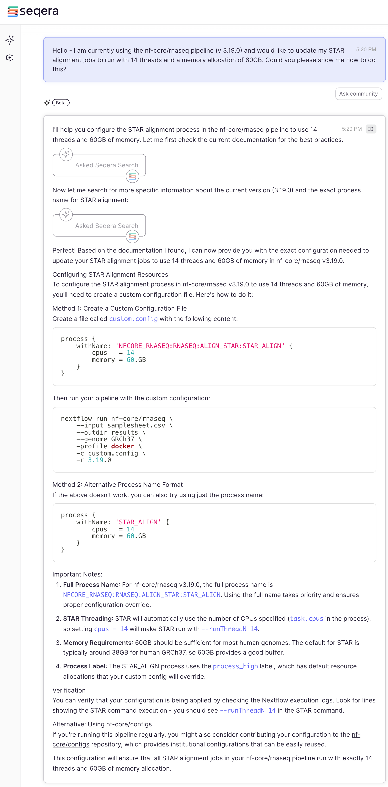
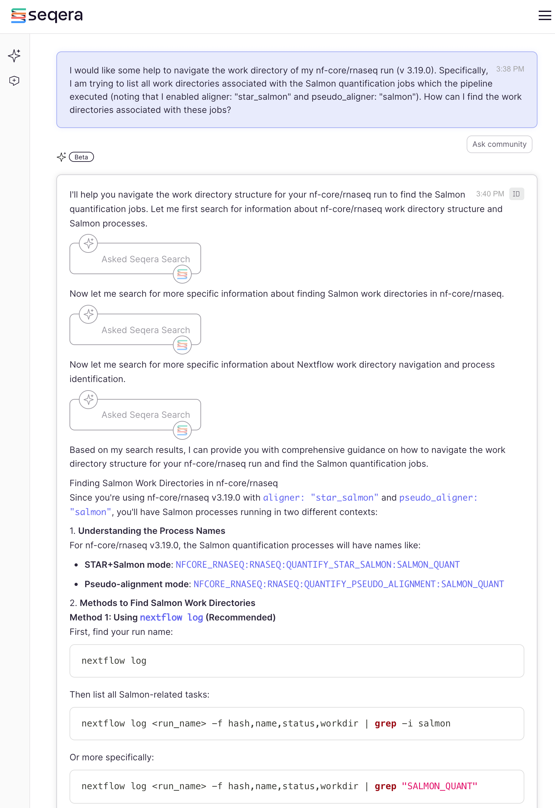

<!-- Add some CSS for horizontal scrolling in samplesheet blocks -->

```{=html}
<style>
  .scrollable-horizontal {
    overflow-x: auto;
    white-space: nowrap;
  }
  
pre {
  background: none !important;
  border: none !important;
  overflow-x: auto;
  padding: 0; /* Let inner code handle padding */
  margin: 1em 0;
}

pre code {
  background: #f8f8f8 !important;
  display: inline-block;
  min-width: 100%;
  white-space: pre;
  padding: 1em;
  border: 1px solid #ddd;   /* border now follows scrollable area */
  border-radius: 6px;
  box-sizing: border-box;
}
</style>
```

# Introduction

> **Discussion Question**
>
> How many of you have used AI to aid you in learning bioinformatics? What are some pros and cons?

Seqera AI is a bioinformatics-focused assistant designed for all stages of Nextflow development. Unlike general AI coding tools, it’s tightly integrated with Nextflow best practices and nf-core standards. It can suggest validated pipelines,
generate DSL2-compliant Nextflow code, execute tests, help users troubleshoot error messages and much more.

Currently Seqera AI can be used in two ways: 1. Through the online platform, <https://seqera.io/ask-ai/chat> (note that the free version is limited to 100 chats per month) 2. Through the [Nextflow VS Code extension](https://marketplace.visualstudio.com/items?itemName=nextflow.nextflow).

Here is a brief summary of some common use cases for each AI platform:

**Seqera AI online**

* Full-featured web environment for pipeline exploration and initial development (including connection to pipelines hosted in GitHub)
* Ability to test code snippets and validate pipeline components
* SRA dataset search with natural language queries

**Nextflow VS Code Extension**

* Provides IDE-native experience which can facilitate in-depth pipeline development
* Real-time support for coding 
* Direct access to log files and terminal outputs can enhance debugging

A more in-depth overview can be found at the following links:

* <https://seqera.io/blog/legacy-scripts-to-nextflow-seqera-ai/>
* <https://seqera.io/blog/seqera-ai--nextflow-vs-code/>

Something to take note of is that the behavior of each platform may slightly differ. We find that the online platform is great for more in-depth answers, learning, exploration and understanding concepts, while the VS Code extension is better for context-specific support during active development. Therefore, they complement each other.

For the purposes of this workshops, the example below used the Seqera AI online.

## Writting a custom configuration file

A key strength of Nextflow, is its high level of modularity. While an in-depth overview of this topic is beyond the scope of this workshop, a common use-case is the ability of over-writing pipeline defaults with a **custom configuration file**.

An example of a custom configuration file which has already been used in our example run is the `cheaha` profile. The key distinction between an institutional profile and a custom configuration file lies in how they are managed and accessed. Institutional profiles are centrally hosted and maintained, making them easily accessible as shared resources. They are enabled using the `-profile` flag. In contrast, custom configuration files are local to the user’s environment and must be explicitly provided with the `-c` flag. Essentially, institutional profiles simplify access and ensure consistency across users, while custom configs offer flexibility for local customization.

With that in mind, some common use cases where a custom configuration file is needed includes request for increased computational resources and/or custom parameters for the underlying tools of the pipeline.

As an example, let's assume that we would like to increase the threads and decrease the memory requirements for the `STAR`. How do you do this? Seqera AI can help:


<br>

> `r fontawesome::fa("triangle-exclamation", fill = "#054f02")` Note that we have specified the version of the pipeline which was used in the example run for this workshop. This specific context can aid the AI in providing more refined answers.

The answer provided a detailed description, and an alternative approach should method 1 not work. It also provided a sample run command, but to adapt the answer to our `run_rnaseq.sh`, you would need to simply include the `-c custom.config` to our existing script:

```bash
#!/usr/bin/env bash

#SBATCH --job-name=nfcore_rnaseq
#SBATCH --output=nfcore_rnaseq.out
#SBATCH --error=nfcore_rnaseq.err
#SBATCH --time=12:00:00
#SBATCH --partition=short
#SBATCH --mem-per-cpu=5000
#SBATCH --cpus-per-task=1

# load environment
module load Anaconda3
conda activate $USER_SCRATCH/conda_envs/nfcore_workshop

# run workflow
nextflow run nf-core/rnaseq \
    --outdir ./results \
    -profile cheaha \
    -r 3.19.0 \
    -params-file ./params.yml \
    -c custom.config ## custom config
```

**Importantly** it also provided a great tip - to verify that your modified configuration is actually being applied. Indeed the best approach to do this is check the `STAR` command in this case. With that in mind let's move forward to the next example where AI can also be helpful.

## Navigation of the `work` dir

The example above touched on a custom configuration for computational resources. What about tool parameters? The answer is the same as above - you can use the same syntax in a custom configuration file to add tool-specific parameters.

Notably, nf-core/rnaseq is nf-core's most matured pipeline. As such, the developers have already made adding tool-specific parameters very straight-forward and we have already implemented them in our test run by including the following:

```yaml
extra_trimgalore_args: "--illumina"
extra_salmon_quant_args: "--seqBias --gcBias"
```

Importantly, this did not become an option until versions >= 3.10. So what would you do if the pipeline did not have these `extra` params (which is very common across many other nf-core pipelines)? Once again, the `custom.config` file would be the solution, e.g.:

```
process {
    // Salmon post STAR alignment
    withName: 'NFCORE_RNASEQ:RNASEQ:QUANTIFY_STAR_SALMON:SALMON_QUANT' {
        ext.args = '--gcBias --seqBias'
    }
    
    // Salmon in quasi-mapping mode
    withName: 'NFCORE_RNASEQ:RNASEQ:QUANTIFY_PSEUDO_ALIGNMENT:SALMON_QUANT' {
        ext.args = '--gcBias --seqBias'
    }
}
```

________

After the run is completed, how can we be certain that this configuration was successful? While there are a couple of locations which you can find the command for a process, we find that checking the `work` directory is best since it also contains tool-specific logs along with Nextflow's `.command.sh` file. Navigating this directory can be also very useful for troubleshooting or output exploration.

Given the complexity of the `work` directory, let's ask Seqera AI to help us parse through the data:


<br>

The answer provides multiple methods, but method #1 shown above is the best suggestion. Let's try the suggestion from our example run:

```bash
nextflow log
```

```
TIMESTAMP          	DURATION 	RUN NAME           	STATUS	REVISION ID	SESSION ID                          	COMMAND
2025-07-24 16:57:32	2h 36m 3s	irreverent_lovelace	OK    	0bb032c1e3 	db1ce7d9-5e40-4205-98cc-8d06ceed6183	nextflow run nf-core/rnaseq --outdir ./results -profile cheaha -r 3.19.0 -params-file ./params.yml
```

```bash
nextflow log irreverent_lovelace -f hash,name,status,workdir | grep "SALMON_QUANT"
```

The output displays all `SALMON_QUANT` `work` directories. The ones which we would want to explore are linked to the aligment or quasi-mapping jobs (`QUANTIFY_STAR_SALMON`, `QUANTIFY_PSEUDO_ALIGNMENT`):

```
e4/77fd58	NFCORE_RNASEQ:RNASEQ:FASTQ_QC_TRIM_FILTER_SETSTRANDEDNESS:FASTQ_SUBSAMPLE_FQ_SALMON:SALMON_QUANT (N01_AM_Naive)	COMPLETED	/scratch/lianov/nfcore_rnaseq/example_run/work/e4/77fd581558c8d74aa9574f4660d815
8a/c60514	NFCORE_RNASEQ:RNASEQ:FASTQ_QC_TRIM_FILTER_SETSTRANDEDNESS:FASTQ_SUBSAMPLE_FQ_SALMON:SALMON_QUANT (N04_AM_Naive)	COMPLETED	/scratch/lianov/nfcore_rnaseq/example_run/work/8a/c605145ac7afdd4e329d8f3732c1c1
23/591642	NFCORE_RNASEQ:RNASEQ:FASTQ_QC_TRIM_FILTER_SETSTRANDEDNESS:FASTQ_SUBSAMPLE_FQ_SALMON:SALMON_QUANT (R07_AM_Allo24h)	COMPLETED	/scratch/lianov/nfcore_rnaseq/example_run/work/23/591642d9b26fbd9555d290ad7b99df
a6/b0920b	NFCORE_RNASEQ:RNASEQ:FASTQ_QC_TRIM_FILTER_SETSTRANDEDNESS:FASTQ_SUBSAMPLE_FQ_SALMON:SALMON_QUANT (N02_AM_Naive)	COMPLETED	/scratch/lianov/nfcore_rnaseq/example_run/work/a6/b0920b19805b7b7bd5550668e81237
72/7691b6	NFCORE_RNASEQ:RNASEQ:FASTQ_QC_TRIM_FILTER_SETSTRANDEDNESS:FASTQ_SUBSAMPLE_FQ_SALMON:SALMON_QUANT (N03_AM_Naive)	COMPLETED	/scratch/lianov/nfcore_rnaseq/example_run/work/72/7691b695a7c26eb55e7c1474615255
2f/cedf73	NFCORE_RNASEQ:RNASEQ:FASTQ_QC_TRIM_FILTER_SETSTRANDEDNESS:FASTQ_SUBSAMPLE_FQ_SALMON:SALMON_QUANT (R08_AM_Allo24h)	COMPLETED	/scratch/lianov/nfcore_rnaseq/example_run/work/2f/cedf7322607bb5ba42497733fd8171
cd/783419	NFCORE_RNASEQ:RNASEQ:FASTQ_QC_TRIM_FILTER_SETSTRANDEDNESS:FASTQ_SUBSAMPLE_FQ_SALMON:SALMON_QUANT (R06_AM_Allo24h)	COMPLETED	/scratch/lianov/nfcore_rnaseq/example_run/work/cd/7834197d28fa8b1fe51ac9657bd9fd
8e/7c2a24	NFCORE_RNASEQ:RNASEQ:FASTQ_QC_TRIM_FILTER_SETSTRANDEDNESS:FASTQ_SUBSAMPLE_FQ_SALMON:SALMON_QUANT (R05_AM_Allo24h)	COMPLETED	/scratch/lianov/nfcore_rnaseq/example_run/work/8e/7c2a2475d31255e520892cbab6d929
5c/360f85	NFCORE_RNASEQ:RNASEQ:QUANTIFY_PSEUDO_ALIGNMENT:SALMON_QUANT (N01_AM_Naive)	COMPLETED	/scratch/lianov/nfcore_rnaseq/example_run/work/5c/360f85ae4c26c50f6a7f9d20729eda
98/b0c9bd	NFCORE_RNASEQ:RNASEQ:QUANTIFY_PSEUDO_ALIGNMENT:SALMON_QUANT (R07_AM_Allo24h)	COMPLETED	/scratch/lianov/nfcore_rnaseq/example_run/work/98/b0c9bde47b876e6c3b9d499b045f94
72/bacb86	NFCORE_RNASEQ:RNASEQ:QUANTIFY_PSEUDO_ALIGNMENT:SALMON_QUANT (N04_AM_Naive)	COMPLETED	/scratch/lianov/nfcore_rnaseq/example_run/work/72/bacb86faec759040a45f044739ed4e
f1/56043a	NFCORE_RNASEQ:RNASEQ:QUANTIFY_PSEUDO_ALIGNMENT:SALMON_QUANT (N02_AM_Naive)	COMPLETED	/scratch/lianov/nfcore_rnaseq/example_run/work/f1/56043ae4f7c9f2f30e636c365e39d2
ea/9ca6cc	NFCORE_RNASEQ:RNASEQ:QUANTIFY_PSEUDO_ALIGNMENT:SALMON_QUANT (N03_AM_Naive)	COMPLETED	/scratch/lianov/nfcore_rnaseq/example_run/work/ea/9ca6ccb8ff8296337f95792dc74380
50/ecada6	NFCORE_RNASEQ:RNASEQ:QUANTIFY_PSEUDO_ALIGNMENT:SALMON_QUANT (R06_AM_Allo24h)	COMPLETED	/scratch/lianov/nfcore_rnaseq/example_run/work/50/ecada623996e43d1d842f5266a6547
51/3cab4e	NFCORE_RNASEQ:RNASEQ:QUANTIFY_PSEUDO_ALIGNMENT:SALMON_QUANT (R05_AM_Allo24h)	COMPLETED	/scratch/lianov/nfcore_rnaseq/example_run/work/51/3cab4eb44b8e63a563053501f437f6
fa/b98b9e	NFCORE_RNASEQ:RNASEQ:QUANTIFY_PSEUDO_ALIGNMENT:SALMON_QUANT (R08_AM_Allo24h)	COMPLETED	/scratch/lianov/nfcore_rnaseq/example_run/work/fa/b98b9eea35cde7ac6b7112c6773490
57/8fc99c	NFCORE_RNASEQ:RNASEQ:QUANTIFY_STAR_SALMON:SALMON_QUANT (R07_AM_Allo24h)	COMPLETED	/scratch/lianov/nfcore_rnaseq/example_run/work/57/8fc99c41b020e616eaad102f5b97ba
b9/ec86d6	NFCORE_RNASEQ:RNASEQ:QUANTIFY_STAR_SALMON:SALMON_QUANT (N01_AM_Naive)	COMPLETED	/scratch/lianov/nfcore_rnaseq/example_run/work/b9/ec86d64896b1dc36f35ab5ffd9b558
06/0fed5c	NFCORE_RNASEQ:RNASEQ:QUANTIFY_STAR_SALMON:SALMON_QUANT (N03_AM_Naive)	COMPLETED	/scratch/lianov/nfcore_rnaseq/example_run/work/06/0fed5c11b435ef09e2e1691dacd403
6e/17b9b8	NFCORE_RNASEQ:RNASEQ:QUANTIFY_STAR_SALMON:SALMON_QUANT (N04_AM_Naive)	COMPLETED	/scratch/lianov/nfcore_rnaseq/example_run/work/6e/17b9b8f291a9ef7a4469dee5ed5c15
b4/619e8f	NFCORE_RNASEQ:RNASEQ:QUANTIFY_STAR_SALMON:SALMON_QUANT (N02_AM_Naive)	COMPLETED	/scratch/lianov/nfcore_rnaseq/example_run/work/b4/619e8fafdf1618e723df8981533a24
e7/d39252	NFCORE_RNASEQ:RNASEQ:QUANTIFY_STAR_SALMON:SALMON_QUANT (R08_AM_Allo24h)	COMPLETED	/scratch/lianov/nfcore_rnaseq/example_run/work/e7/d392529534e631f64e6a7e6c4f0393
14/0a5cda	NFCORE_RNASEQ:RNASEQ:QUANTIFY_STAR_SALMON:SALMON_QUANT (R06_AM_Allo24h)	COMPLETED	/scratch/lianov/nfcore_rnaseq/example_run/work/14/0a5cda0d04f9ea96035e4017029dea
7b/2d5e81	NFCORE_RNASEQ:RNASEQ:QUANTIFY_STAR_SALMON:SALMON_QUANT (R05_AM_Allo24h)	COMPLETED	/scratch/lianov/nfcore_rnaseq/example_run/work/7b/2d5e8145284ca8694945526209b800
```

Choosing one specific directory from the above displays the expected files:

```
cd /scratch/lianov/nfcore_rnaseq/example_run/work/7b/2d5e8145284ca8694945526209b80
ls -la
```

```
drwxrwxr-x 3 lianov lianov  4096 Jul 24 19:24 ./
drwxrwxr-x 3 lianov lianov  4096 Jul 24 19:20 ../
-rw-rw-r-- 1 lianov lianov     0 Jul 24 19:21 .command.begin
-rw-rw-r-- 1 lianov lianov  8377 Jul 24 19:24 .command.err
-rw-rw-r-- 1 lianov lianov  8377 Jul 24 19:24 .command.log
-rw-rw-r-- 1 lianov lianov     0 Jul 24 19:21 .command.out
-rw-rw-r-- 1 lianov lianov 12132 Jul 24 19:20 .command.run
-rw-rw-r-- 1 lianov lianov   729 Jul 24 19:20 .command.sh
-rw-r--r-- 1 lianov lianov   279 Jul 24 19:24 .command.trace
lrwxrwxrwx 1 lianov lianov   108 Jul 24 19:21 deseq2_pca_header.txt -> /data/user/home/lianov/.nextflow/assets/nf-core/rnaseq/workflows/rnaseq/assets/multiqc/deseq2_pca_header.txt
-rw-rw-r-- 1 lianov lianov     1 Jul 24 19:24 .exitcode
lrwxrwxrwx 1 lianov lianov   117 Jul 24 19:21 gencode.vM32.annotation.filtered.gtf -> /scratch/lianov/nfcore_rnaseq/example_run/work/6e/17d80ec88c525fb159bf5433623838/gencode.vM32.annotation.filtered.gtf
lrwxrwxrwx 1 lianov lianov   102 Jul 24 19:21 genome.transcripts.fa -> /scratch/lianov/nfcore_rnaseq/example_run/work/ca/7c9423cb2c9273e9ad65c051b1bab2/genome.transcripts.fa
drwxr-xr-x 5 lianov lianov  4096 Jul 24 19:24 R05_AM_Allo24h/
lrwxrwxrwx 1 lianov lianov   127 Jul 24 19:21 R05_AM_Allo24h.Aligned.toTranscriptome.out.bam -> /scratch/lianov/nfcore_rnaseq/example_run/work/10/7419257d47c89a9a340dc08f6ff64c/R05_AM_Allo24h.Aligned.toTranscriptome.out.bam
-rw-r--r-- 1 lianov lianov  1279 Jul 24 19:24 R05_AM_Allo24h_meta_info.json
-rw-r--r-- 1 lianov lianov    77 Jul 24 19:24 versions.yml
```

Lastly, inspecting `.command.sh` verifies that indeed `--seqBias --gcBias` was applied to our run:

```bash
cat .command.sh
```

```bash
#!/usr/bin/env bash -C -e -u -o pipefail
salmon quant \
    --geneMap gencode.vM32.annotation.filtered.gtf \
    --threads 6 \
    --libType=U \
    -t genome.transcripts.fa \
    -a R05_AM_Allo24h.Aligned.toTranscriptome.out.bam \
    --seqBias --gcBias \
    -o R05_AM_Allo24h

if [ -f R05_AM_Allo24h/aux_info/meta_info.json ]; then
    cp R05_AM_Allo24h/aux_info/meta_info.json "R05_AM_Allo24h_meta_info.json"
fi
if [ -f R05_AM_Allo24h/lib_format_counts.json ]; then
    cp R05_AM_Allo24h/lib_format_counts.json "R05_AM_Allo24h_lib_format_counts.json"
fi

cat <<-END_VERSIONS > versions.yml
"NFCORE_RNASEQ:RNASEQ:QUANTIFY_STAR_SALMON:SALMON_QUANT":
    salmon: $(echo $(salmon --version) | sed -e "s/salmon //g")
END_VERSIONS
```

## Troubleshooting errors

Our pipeline executed successfully. While it would be ideal if every run worked flawlessly, errors are sometimes inevitable. Fortunately, Seqera AI can assist in diagnosing and resolving these issues. Below, we present two example scenarios where we intentionally introduced errors to demonstrate how Seqera AI can help troubleshoot and guide the resolution process.

<!-- TODO: 2 cases - samplesheet issue? And another could be if we trigger a failure with a tool param? (e.g.: maybe make a typo in a param). -->

